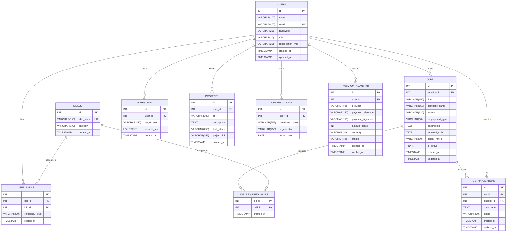

# ER Diagram (SkillConnect DB)

## Relationship and Integrity Rules

1. `users` to `jobs` is `1:N` via `jobs.recruiter_id -> users.id` (`ON DELETE CASCADE`).
2. `users` to `skills` is `M:N` via associative table `user_skills`.
3. `jobs` to `skills` is `M:N` via associative table `job_required_skills`.
4. `jobs` to `job_applications` is `1:N` via `job_applications.job_id -> jobs.id` (`ON DELETE CASCADE`).
5. `users` to `job_applications` is `1:N` via `job_applications.student_id -> users.id` (`ON DELETE CASCADE`).
6. `users` to `ai_resumes` is `1:N` via `ai_resumes.user_id -> users.id` (`ON DELETE CASCADE`).
7. `users` to `projects` is `1:N` via `projects.user_id -> users.id` (`ON DELETE CASCADE`).
8. `users` to `certifications` is `1:N` via `certifications.user_id -> users.id` (`ON DELETE CASCADE`).
9. `users` to `premium_payments` is `1:N` via `premium_payments.user_id -> users.id` (`ON DELETE CASCADE`).

## Key Rules

1. Primary keys: all base entities use single-column PK `id`, except `job_required_skills` which uses composite PK `(job_id, skill_id)`.
2. Unique constraints:
   - `users.email`
   - `skills.skill_name`
   - `user_skills (user_id, skill_id)` (no duplicate skill per user)
   - `job_applications (job_id, student_id)` (one application per student per job)
   - `premium_payments (provider, payment_reference)` (no duplicate payment reference per provider)
3. Mandatory foreign keys (`NOT NULL`) enforce total participation on child side in core relationship tables; note `projects.user_id` is nullable in the live schema.

## Attribute and Domain Rules

1. Default values:
   - `users.role = 'student'`
   - `users.subscription_type = 'free'`
   - `user_skills.proficiency_level = 'beginner'`
   - `jobs.location = 'Remote'`
   - `jobs.employment_type = 'full-time'`
   - `jobs.is_active = 1`
   - `job_applications.status = 'applied'`
   - `premium_payments.status = 'verified'`
2. Application-level allowed values:
   - `role in {student, recruiter, admin}` (registration allows `{student, recruiter}`)
   - `subscription_type in {free, premium}`
   - `proficiency_level in {beginner, intermediate, advanced, expert}`
   - `job_applications.status in {applied, shortlisted, interview, rejected, hired}`
   - `jobs.employment_type in {full-time, part-time, internship, contract}`
3. Optional attributes (`NULL` allowed):
    - `skills.category`
    - `jobs.required_skills` (legacy denormalized storage)
    - `jobs.salary_range`
    - `job_applications.cover_letter`
    - `projects.user_id`, `projects.description`, `projects.tech_stack`, `projects.project_link`
    - `certifications.organization`, `certifications.issue_date`
    - `premium_payments.amount_cents`, `premium_payments.currency`, `premium_payments.verified_at`
    - `users.updated_at`, `jobs.updated_at`, `job_applications.updated_at`
